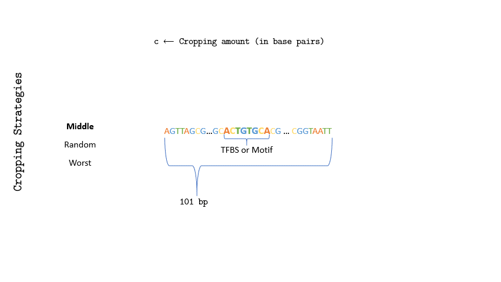

# Translational robustness of neural networks trained for transcription factor binding site classification
This repo contains the sourcecode for the paper: Translational robustness of neural networks
trained for transcription factor binding site classification

</img>

## Evironment setup
```
conda create -n env_name python=3.6
conda activate env_name
conda install tensorflow-gpu==2.1
```
## Datasets
* [Zeng's dataset(D<sub>s</sub>)](http://cnn.csail.mit.edu/)
* [DeepSea dataset information(D<sub>l</sub>)](http://deepsea.princeton.edu/help/ "DeepSea dataset")
    * [Direct download link of .mat files](http://deepsea.princeton.edu/media/code/deepsea_train_bundle.v0.9.tar.gz)

Data conversion from `.mat` to `.npz` can be done by:  
`python convert_data.py --in_fname path_to_mat --out_fname path_to_output_npz`

Alternatively, you can download our converted data from [here](https://uszeged-my.sharepoint.com/:f:/g/personal/pap_gergely_1_o365_u-szeged_hu/EmfyJP3jFWFLjxe_NK2t3N0BGFOBTn-kCO0Id8dOoV9N0A?e=yAiAx2). 

## Model training
Our best models can be downloaded from [here](https://uszeged-my.sharepoint.com/:f:/g/personal/pap_gergely_1_o365_u-szeged_hu/Eo9ntvgjGjdMjWVLWxgLXq4Bz4L9fqJCyhbM8wuX1wdLIw?e=6LDzNK).

* on D<sub>s</sub> dataset:
```
python train_zeng.py --attack attacks.MiddleCrop --fname path_to_data  
python train_zeng.py --attack attacks.RandomCrop --fname path_to_data
python train_zeng.py --attack attacks.WorstCrop --fname path_to_data
```
* on D<sub>l</sub> dataset:
```
python train_tbinet.py --attack attacks.MiddleCrop --data_dir path_to_data_dir  
python train_tbinet.py --attack attacks.RandomCrop --data_dir path_to_data_dir
python train_tbinet.py --attack attacks.WorstCrop --data_dir path_to_data_dir
```
## Model evaluation
* on D<sub>s</sub> dataset:
```
python eval_trans_attack.py --attack attacks.MiddleCrop --model_path path_to_model --data_path path_to_data --seq_length [75|90|95|101] --metric acc
python eval_trans_attack.py --attack attacks.RandomCrop --model_path path_to_model --data_path path_to_data --seq_length [75|90|95|101] --metric acc
python eval_trans_attack.py --attack attacks.WorstCrop --model_path path_to_model --data_path path_to_data --seq_length [75|90|95|101] --metric acc --loss xe
```
* on D<sub>l</sub> dataset:
```
python eval_trans_attack.py --attack attacks.MiddleCrop --model_path path_to_model --data_path path_to_test_set --seq_length [900|1000] --metric auc,aupr
python eval_trans_attack.py --attack attacks.RandomCrop --model_path path_to_model --data_path path_to_test_set --seq_length [900|1000] --metric auc,aupr
python eval_trans_attack.py --attack attacks.WorstCrop --model_path path_to_model --data_path path_to_test_set --seq_length [900|1000] --metric auc,aupr --loss bce --n_try 20
```


Results of the Evaluations: [here](https://uszeged-my.sharepoint.com/:f:/g/personal/pap_gergely_1_o365_u-szeged_hu/ErXUaVN-uFJGkeKw9GnxmQkB6RdA3RfsG4NW3z_KybF6-w?e=sxskCw)
